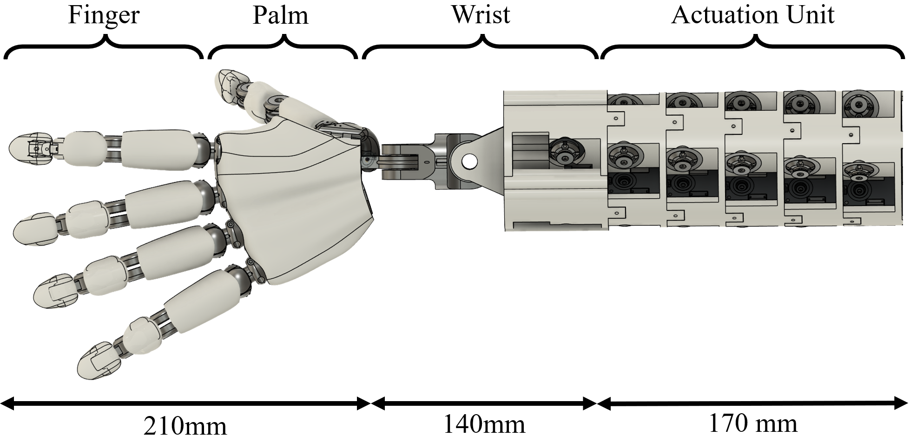

# 24 DOF Anthropomorphic Robotic Hand

This repository contains the design files and source code for a 24-degree-of-freedom tendon-driven anthropomorphic robotic hand developed by the New Dexterity research group at the University of Auckland.

[](https://youtu.be/ohg968oTFxQ)


## Overview

The 24 DOF Anthropomorphic Robotic Hand is an open-source project that provides a fully functional dexterous robotic hand design. The hand features a highly biomimetic design with 24 actuated degrees of freedom including the wrist. It is designed to be affordable, lightweight, and anthropomorphic, making it suitable for research in dexterous manipulation, human-robot interaction, and potential prosthetic applications.


## Table of Contents

- [Project Structure](#project-structure)
- [Mechanical Design](#mechanical-design)
- [Electronics](#electronics)
- [Software](#software)
- [Assembly Instructions](#assembly-instructions)
- [Technical Specifications](#technical-specifications)
- [Getting Started](#getting-started)
- [Contributing](#contributing)
- [License](#license)
- [Citation](#citation)

## Project Structure

The repository is organized as follows:

```
├── CAD/                    # CAD files (STL, STEP, etc.)
│   ├── fingers/            # Finger component designs
│   │   ├── distal/         # Distal phalanx designs
│   │   ├── middle/         # Middle phalanx designs
│   │   ├── proximal/       # Proximal phalanx designs
│   │   └── thumb/          # Thumb-specific components
│   ├── palm/               # Palm component designs
│   ├── wrist/              # Wrist component designs
│   ├── actuation_unit/     # Actuation housing components
│   └── assembly/           # Full assembly files (STL, STEP)
│
├── src/                    # Source code
│   ├── firmware/           # Firmware for controlling the hand
│   │   └── dynamixel/      # Dynamixel motor control code
│   └─── control/            # High-level control code
│
├── docs/                   # Documentation
│   ├── assembly_instructions/  # Step-by-step assembly guide
│   ├── images/             # Images for documentation
│   ├── BOM.md              # Bill of Materials
│   ├── technical_specs.md  # Technical specifications
│   └── tendon_routing.md   # Tendon routing documentation
│
└── LICENSE                 # License information
```

## Mechanical Design

The CAD files for the robotic hand can be found in the [CAD](./CAD) directory. The hand features:

- 24 DoF including wrist motion
- Anthropomorphic design with biomimetic joint structures
- Ball-and-socket joints for MCP and CMC joints
- 1-DoF pin joints for PIP and DIP joints
- Simplified carpal bone structures in the palm
- 3D-printable components
- Tendon-driven actuation system



## Electronics

The hand is actuated by 24 Dynamixel XC-330-T228-T servo motors. Electronic design files, including schematics and wiring diagrams, can be found in the [electronics](./electronics) directory.

The actuation system features:
- 24 Dynamixel XC-330-T228-T servo motors (~$89.90 USD each)
- Modular design with 5 modules containing 4 actuators each
- Total actuation system cost under $2,300 USD

## Software

The source code for controlling the robotic hand can be found in the [src](./src) directory. The code includes:

- Dynamixel SDK wrapper for motor control
- High-level hand control code
- GUI for controlling the hand

## Assembly Instructions

Detailed assembly instructions can be found in the [docs/assembly_instructions](./docs/assembly_instructions) directory. This includes:

<!-- - Step-by-step assembly guides -->
<!-- - Tendon routing instructions
- Wiring diagrams
- Calibration procedures -->

## Technical Specifications

- **Degrees of Freedom**: 24 (including 2 for the wrist)
- **Total Weight**: Approximately 1.45 kg
- **Actuation**: Tendon-driven using Dynamixel servo motors
- **Tendon System**: Multi-layer sheath system (tension spring outer layer, PTFE middle layer, high-strength braided fishing line inner layer)
- **Materials**: 3D printed components and off-the-shelf parts
<!--- **Workspace**: Comparable to the Shadow Hand (see [experiments/workspace_analysis](./experiments/workspace_analysis))-->
<!--- **Repeatability**: High repeatability with average standard deviation <1mm in position and <5.3° in orientation-->

## Getting Started

### Prerequisites

- 3D printer
- Dynamixel motors (24x XC-330-T228-T)
- Dynamixel controllers
- Basic electronic tools and components
- High-strength fishing line for tendons
- PTFE tubing and tension springs for tendon sheaths

### Installation and Setup

<!-- 1. Clone this repository
2. Follow the [assembly instructions](./docs/assembly_instructions)
3. Install the required software dependencies
4. Connect the hand to your computer and run the example code -->

## Contributing

<!-- Contributions to the project are welcome! Please see [CONTRIBUTING.md](./CONTRIBUTING.md) for details. -->

## License

<!-- This project is licensed under the [MIT License](./LICENSE). -->

## Citation

<!-- If you use this design in your research, please cite: -->

<!-- ```
@inproceedings{Kobayashi_Liarokapis_2025,
  title={Design of Highly-Actuated, Anthropomorphic Robotic Hand Testbed for Dexterous Manipulation Tasks},
  author={Kobayashi, Masahiro and Liarokapis, Minas},
  booktitle={IEEE/RSJ International Conference on Intelligent Robots and Systems (IROS)},
  year={2025}
}
``` -->

## Acknowledgments

